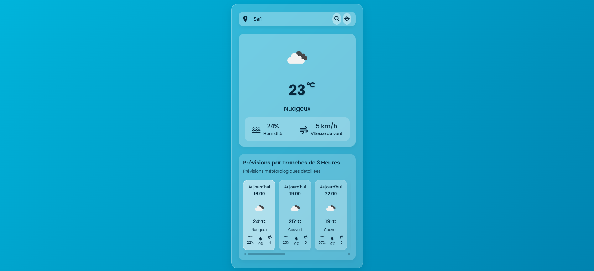

# 🌤️ Application Météo

Bienvenue dans notre projet d’application météo ! Cette application simple et moderne vous permet de consulter les conditions météorologiques actuelles et les prévisions à court terme pour une ville de votre choix, en utilisant une API météo tierce.

## 🎯 Objectif du Projet

L’objectif principal est de développer une **application météo conviviale et intuitive**, permettant aux utilisateurs d’obtenir rapidement des informations météorologiques précises pour une ville donnée.

---

## ⚙️ Fonctionnalités

- **🔍 Recherche par Ville** : Saisissez le nom d’une ville pour obtenir instantanément ses prévisions météo.
- **🌡️ Conditions Actuelles** :
  - Température
  - Humidité
  - Vitesse du vent
  - Description météo (ensoleillé, nuageux, pluie, etc.)
- **⏳ Prévisions à Court Terme** :
  - Affichage des prévisions pour les **3 prochaines heures**.
- **💅 Interface Moderne** :
  - Design responsive, clair et agréable à utiliser
  - Utilisation d’icônes météo pour une meilleure lisibilité

---

## 🛠️ Technologies Utilisées

- **HTML5 / CSS3**
- **JavaScript (Vanilla JS)**
- **API Météo** (ex : OpenWeatherMap)
- **[FontAwesome](https://fontawesome.com/)** ou **[Weather Icons](https://erikflowers.github.io/weather-icons/)** pour les icônes météo

---

## 📸 Aperçu de l'application



---

## 🚀 Lancer le Projet en Local

1. **Cloner le dépôt :**
   ```bash
   git clone https://github.com/HamzaBraik01/weather-app.git
